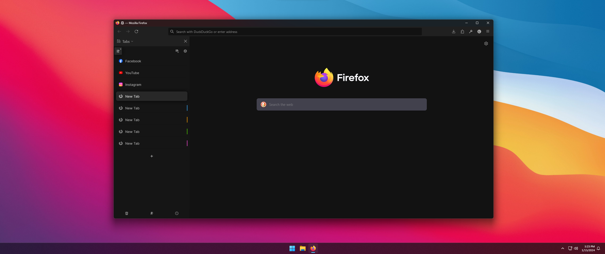
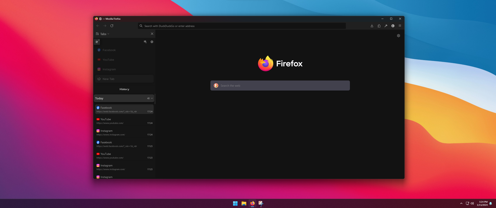

# Firefox and Sidebery CSS

This is my Firefox and CSS theme to make a beautiful sidebar

## Disclaimer

This CSS will not adapt to other themes, i made it FOR ME with absolute color values, (the code is a mess and im not proud of it)

If its get some requests i can try to make it more flexible, but for me its more than enough

## Thanks to

I took most of UserChrome.css file from [this](https://www.reddit.com/r/FirefoxCSS/comments/rmi8dg/yet_another_sidebery_setup/) reddit user